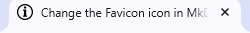

# How to change the Favicon icon in MkDocs 

Changing the favicon in a documentation site helps with branding and recognition. This guide will help you change the Favicon icon in **Material for MkDocs** and **Read the Docs for MkDocs** themes available in **MkDocs**.

## **Prerequisites:**  
Before proceeding, make sure you have:

- A documentation project using MkDocs.
- The *Material or Read the Docs* theme installed.
- A `.ico` or `.png` file ready to use as your favicon. 
    - Named simply, like `favicon.ico` or `favicon.png`
    - Ideally in 32x32 pixels

-----

## **For Material Theme**

### **Step 1 : Place your Favicon file**
Place your favicon file (typically `favicon.ico`, but `.png` also works) in the `docs/` directory or a subdirectory like `docs/img/`.

For Example:  
```pgsql
my-project/
├── docs/
│   ├── img/
│   │   └── favicon.ico
│   └── index.md
├── mkdocs.yml
```

-----

### **Step 2 : Update the `mkdocs.yml` file**
Add the following under the `theme:` section in your `mkdocs.yml`:
```yaml
theme:
  name: material
  favicon: img/favicon.ico
```
Make sure the path is relative to the `docs/` directory.

Here's the complete example with *material* theme:
```yaml
site_name: How-to-Guides

theme: 
  name: material
  favicon: img/favicon.ico

markdown_extensions: # Some extensions to beautify code, etc
  - codehilite
  - pymdownx.highlight
  - pymdownx.superfences
  - admonition
  - pymdownx.details


nav: # Structure of the page
  - Host MkDocs project using GitHub Pages: index.md
  - Change the Favicon icon in MkDocs: fav.md
```

-----

### **Step 3 : Preview your Changes**
After the changes, run:
```bash
mkdocs serve
```
Then open your browser at `http://127.0.0.1:8000` — the favicon should now appear in the tab.  As here, you can see **ⓘ icon** as the favicon in the browser tab. 



-----

## **For Read the Docs Theme**

### **Step 1 : Place your Favicon file**
Place your favicon file (typically `favicon.ico`, but `.png` also works) in the `docs/` directory or a subdirectory like `docs/img/`.

For Example:  
```pgsql
my-project/
├── docs/
│   ├── img/
│   │   └── favicon.ico
│   └── index.md
├── mkdocs.yml
```

-----

### **Step 2 : Do not Update the `mkdocs.yml` file**
MkDocs will automatically detect and use the `favicon.ico` in the `docs/img` folder as your favicon icon.
```yaml
theme:
  name: material
```

Here's the complete example with *readthedocs* theme:
```yaml
site_name: How-to-Guides

theme: 
  name: readthedocs

markdown_extensions: # Some extensions to beautify code, etc
  - codehilite
  - pymdownx.highlight
  - pymdownx.superfences
  - admonition
  - pymdownx.details


nav: # Structure of the page
  - Host MkDocs project using GitHub Pages: index.md
  - Change the Favicon icon in MkDocs: fav.md
```

-----

### **Step 3 : Serve & Test locally**
After the changes, run your site locally:
```bash
mkdocs serve
```
Visit `http://127.0.0.1:8000` and check your browser tab for the updated favicon. As here, you can see **ⓘ icon** as the favicon in the browser tab. 


-----

## **Troubleshooting Tips**

- **Cache issues** : If the favicon doesn’t update, try a hard refresh `(Ctrl+Shift+R)` or clear browser cache.
-  Use `.ico` for better cross-browser compatibility.

-----

## **Sample Folder Structure**
```pgsql
project-name/
├── docs/
│   ├── index.md
│   ├── img/
│   │   └── favicon.ico
├── mkdocs.yml
```

-----

## **Resources**
- [MkDocs Documentation](https://www.mkdocs.org)  

- [Material for MkDocs](https://squidfunk.github.io/mkdocs-material/)

- [ReadtheDocs Guide](https://docs.readthedocs.com/platform/stable/)