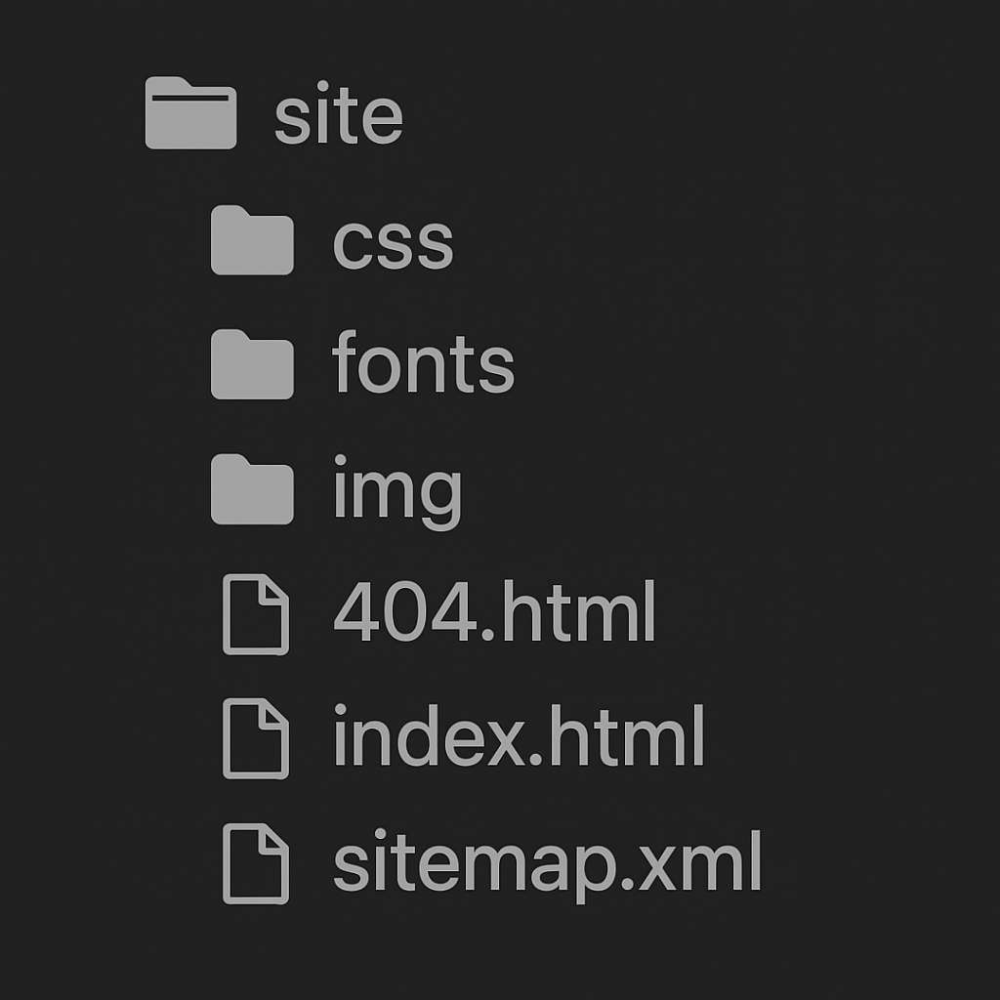

# How to host MkDocs Project using GitHub Pages 

This step-by-step guide will walk you through creating a documentation site with **MkDocs** and hosting it using **GitHub Pages**.
 
## **Prerequisites:**  
   - Basic knowledge of Git and GitHub  
   - Python 3.7 or above installed  
   - Git installed  
   - A GitHub account  
  
-----


## **Step 1: Create a New MkDocs Project**

1. Install MkDocs:
```bash
pip install mkdocs
```

2. Create a new project:
```bash
mkdocs new my-docs
cd my-docs
```

3. Preview your site locally 
```bash
mkdocs serve
```
Follow the link - `http://127.0.0.1:8000` in your browser & you'll see the default homepage being displayed :


-----

## **Step 2: Initialise Git Repository**

1. Initialise a Git repo and commit files 
```bash
git init
git add .
git commit -m "Initial MkDocs site"
```

2. Create a new repository on GitHub (e.g., `my-docs-site`)
3. Link the remote and push:
```bash
git remote add origin https://github.com/YOUR_USERNAME/my-docs-site.git
git branch -M main
git push -u origin main
```

-----

## **Step 3: Configure `mkdocs.yml`**
1. Add or update the following lines in `mkdocs.yml`
```bash
site_name: My Docs
theme:
  name: material  
```
2. Install Material theme (if used):
```bash
pip install mkdocs-material
```

-----

## **Step 4: Build the Site**
Generate the static files using:
```bash
mkdocs build
```
This creates a `site/` directory containing the final HTML that looks like this:




-----

## **Step 5: Deploy to GitHub Pages**
1. Deploy using:
```bash
mkdocs gh-deploy
```

2. This command:
    - Builds the site
    - Pushes it to the gh-pages branch on your GitHub repo

!!! note
      *Make sure your GitHub repo has gh-pages enabled in settings.*

-----

## **Step 6: Enable GitHub Pages**
1. Go to your GitHub repo’s *Settings > Pages*

2. Choose Branch: gh-pages `/ (root)` folder

3. Save the changes


-----

## **Step 7: Access Your Documentation Site**
Your GitHub Pages hosted site will be available at:
```cpp
https://YOUR_USERNAME.github.io/REPO_NAME/
```
Example:
```cpp
https://charvi-rajput.github.io/my-docs-site/
```

-----

## **Resources**
- [MkDocs Documentation](https://www.mkdocs.org)  

- [Material for MkDocs](https://squidfunk.github.io/mkdocs-material/)

- [GitHub Pages](https://pages.github.com)  